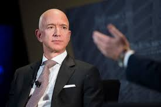

# Jeff Bezos made only $81,840 last year. He's still the richest person in the world.

In the past two decades, Jeff Bezos made the same **$81,840** salary. However, he receives over one million dollars in services and travel expenses and has over $100 billion in Amazon stock. He is not the only CEO to receive a low salary. CEOs like *Steve Jobs* and *Sergey Brin* only took a $1 salary. 
>Amazon says its security costs are "especially reasonable in light of his low salary and the fact that he has never received any stock-
based compensation."

Additional Information

* Bezos used to get paid even less: In 1994 he made $64,333.
* Bezos makes more than the median Amazon salary though, which is $28,836. 
* Amazon recently raised its minimum wage to $15 an hour for its full time employees. 
